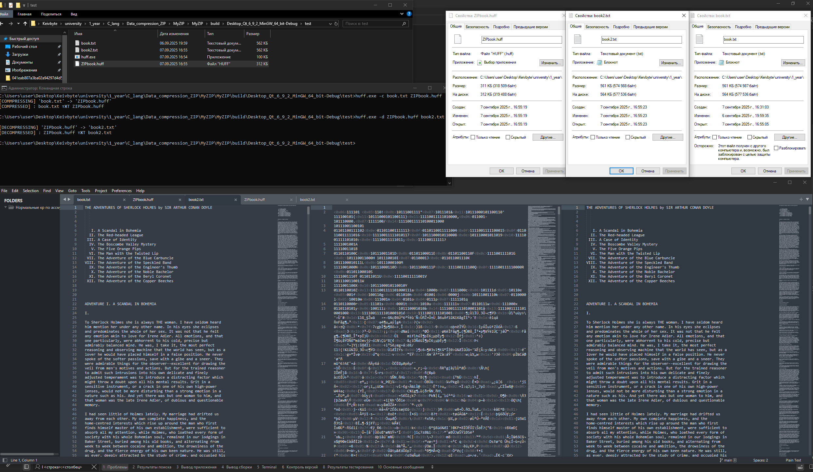

# MyZIP – Huffman Coding File Compressor

A simple yet effective **command-line file compression tool** built in C using **Huffman coding algorithm**. This program compresses `.txt` files into a custom `.huff` binary format and decompresses them back to their original form with zero data loss.

> **Tested on large text files** — successfully compressed a **574,987-byte book** down to **318,509 bytes**, achieving nearly **44% compression rate**!

---

## Compression in Action

  
*Above: Encoding and decoding a book using MyZIP. The original text is perfectly restored after decompression.*

---

## Features

- Lossless compression using **Huffman coding**
- Custom `.huff` binary format with embedded code table
- Command-line interface (CLI) for easy integration
- High compression ratio for text files
- Full round-trip accuracy: `original → compressed → original`
- Works on any ASCII text file
- Built with C and CMake – portable and lightweight

---

## How to Use

### Compress a File
```bash
./MyZIP -c input.txt output.huff
```

### Decompress a File
```bash
./MyZIP -d input.huff output.txt
```

> The decompressed file will be **bit-for-bit identical** to the original.

---

## Project Structure

```
MyZIP/
├── build_tree.c       # Build frequency table and Huffman tree
├── generate_codes.c   # Generate binary codes from the tree
├── encode.c           # Encode text into compressed binary
├── decode.c           # Decode binary back to text
├── huffman.c          # Core logic: compress/decompress
├── main.c             # CLI entry point
└── CMakeLists.txt     # Build configuration
```

---

## Build Instructions

### 1. Configure with CMake
```bash
mkdir build
cd build
cmake ..
```

### 2. Compile
```bash
make
```

### 3. Run
```bash
./MyZIP -c ../book.txt book.huff
./MyZIP -d book.huff book_restored.txt
```

---

## Compression Results

| File | Size |
|------|------|
| Original Book (`book.txt`) | 574,987 bytes |
| Compressed (`book.huff`)   | 318,509 bytes |
| **Reduction**              | **~44.6%** |

This demonstrates the power of entropy-based compression on natural language text.

---

## University Project

**Course**: Computer Science and Engineering (Automated Information Processing and Control Systems)
**Year**: First Year, Computer Science  
**Language**: C  
**Toolchain**: GCC + CMake + Make

Perfect for understanding:
- Dynamic memory management
- Binary trees and priority queues
- Bit manipulation
- File I/O and data serialization
- Algorithmic efficiency

---

## CMakeLists.txt

```cmake
cmake_minimum_required(VERSION 3.16)
project(MyZIP LANGUAGES C)

add_executable(MyZIP
    build_tree.c
    generate_codes.c
    encode.c
    decode.c
    huffman.c
    main.c)

include(GNUInstallDirs)
install(TARGETS MyZIP
    LIBRARY DESTINATION ${CMAKE_INSTALL_LIBDIR}
    RUNTIME DESTINATION ${CMAKE_INSTALL_BINDIR}
)
```
