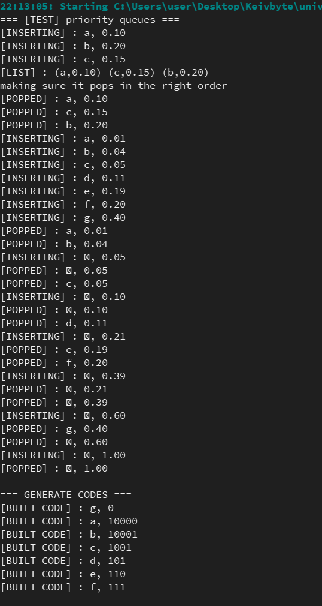
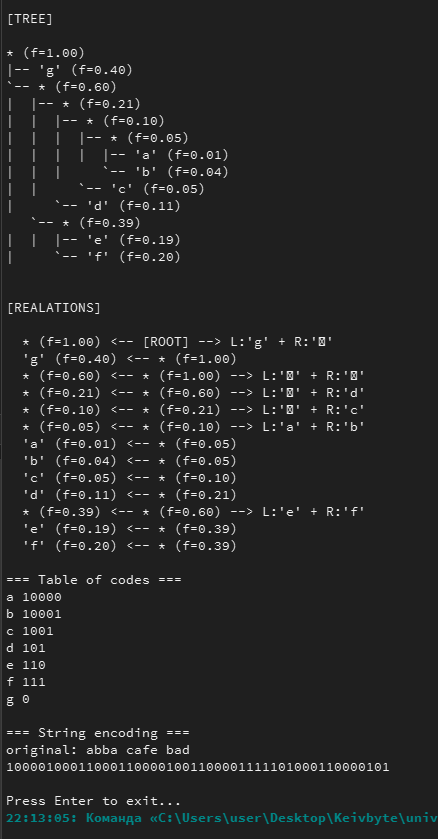

# README.md

---

## Huffman Coding Project (University Assignment)

This is a **Huffman coding implementation in C** that compresses text using variable-length codes based on character frequencies. It builds a **Huffman tree**, generates binary codes for each character, and encodes a sample message.

It's perfect for learning how data compression works under the hood — like in ZIP files or image formats!

---

### What Is Huffman Coding?

Huffman coding is a lossless data compression algorithm. It assigns **shorter codes to frequent characters** and **longer codes to rare ones**, reducing the total number of bits needed to represent text.

For example:
- 'e' appears often → gets short code like `0`
- 'z' appears rarely → gets long code like `1101`

This project shows how to build this system step by step.

---

### How the Code Works

Here’s a breakdown of the main parts:

#### 1. **Node Structure (`struct tnode`)**
Each node represents either:
- A **leaf** (a real character like `'a'`)
- An **internal node** (used only in the tree structure)

```c
struct tnode {
  struct tnode *left;   // left child
  struct tnode *right;  // right child
  struct tnode *parent; // parent node
  struct tnode *next;   // next in priority queue
  float freq;           // frequency of the symbol
  int isleaf;           // 1 = leaf, 0 = internal node
  char symbol;          // character (only for leaves)
};
```

Think of it as a hybrid between a **binary tree node** and a **linked list node**.

---

#### 2. **Priority Queue (Sorted by Frequency)**

We use a **linked list sorted in ascending order of frequency** to simulate a min-priority queue.

Example:  
Initial frequencies:  
`a:0.01, b:0.04, c:0.05, d:0.11, e:0.19, f:0.20, g:0.40`

In the queue:  
```
[a(0.01)] → [b(0.04)] → [c(0.05)] → [d(0.11)] → [e(0.19)] → [f(0.20)] → [g(0.40)]
```

We always take the two smallest nodes from the front.

---

#### 3. **Building the Huffman Tree**

We repeat this process **N−1 times** (where N = number of symbols):

1. Pop two nodes with the lowest frequencies (`lc`, `rc`)
2. Create a new internal node with:
   - Frequency = `lc.freq + rc.freq`
   - Left child = `lc`
   - Right child = `rc`
3. Insert the new node back into the queue

---

### Step-by-Step Tree Building (Pseudographics)

Let’s walk through building the tree visually.

#### Initial Queue:
```
(a:0.01) → (b:0.04) → (c:0.05) → (d:0.11) → (e:0.19) → (f:0.20) → (g:0.40)
```

#### Step 1: Combine a(0.01) + b(0.04) → ab(0.05)
```
(c:0.05) → (ab:0.05) → (d:0.11) → (e:0.19) → (f:0.20) → (g:0.40)
```

#### Step 2: Combine c(0.05) + ab(0.05) → cab(0.10)
```
(d:0.11) → (cab:0.10) → (e:0.19) → (f:0.20) → (g:0.40)
```

#### Step 3: Combine d(0.11) + cab(0.10) → dcab(0.21)
```
(e:0.19) → (f:0.20) → (dcab:0.21) → (g:0.40)
```

#### Step 4: Combine e(0.19) + f(0.20) → ef(0.39)
```
(dcab:0.21) → (ef:0.39) → (g:0.40)
```

#### Step 5: Combine dcab(0.21) + ef(0.39) → dcef(0.60)
```
(g:0.40) → (dcef:0.60)
```

#### Step 6: Combine g(0.40) + dcef(0.60) → ROOT(1.00)

Final Huffman Tree:
```
                [ROOT:1.0]
               /           \
           [g:0.4]       [dcef:0.6]
                        /          \
                  [dcab:0.21]    [ef:0.39]
                 /        \       /       \
             [d:0.11] [cab:0.1] [e:0.19] [f:0.20]
                          /   \
                     [ab:0.05] [c:0.05]
                      /    \
                   [a:0.01][b:0.04]
```

---

### How `generate_code()` Works

This function **traverses the tree** and builds binary codes for each leaf.

#### Algorithm:
```text
Start at root, go to each leaf.
When returning back to parent:
  - If you came from LEFT → add '0'
  - If you came from RIGHT → add '1'
Build the code backwards (from leaf to root)
```

#### Example: Building code for `'a'`
Path: `root → ... → ab → a`

Backtracking:
1. `a` ← `ab`: a is left child → `'0'`
2. `ab` ← `cab`: ab is left child → `'0'`
3. `cab` ← `dcab`: cab is right child → `'1'`
4. `dcab` ← `dcef`: dcab is left child → `'0'`
5. `dcef` ← `root`: dcef is right child → `'1'`

So code for `'a'` = `"10100"` (but built in reverse order during traversal)



