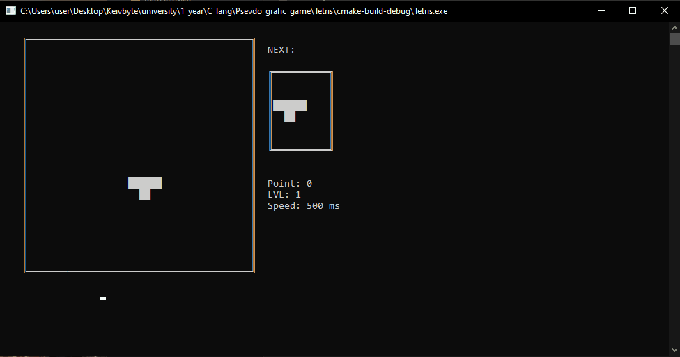

# README

This is a simple Tetris game implemented in C using the Windows API for console graphics.

- **Author**: Keith_Br0
- **Gameplay**: Use arrow keys to move and rotate pieces. Press space to pause/unpause.
- **Features**: Game over animation with "YOU DEAD" and blood effect.
- 