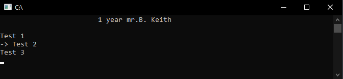
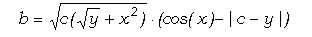
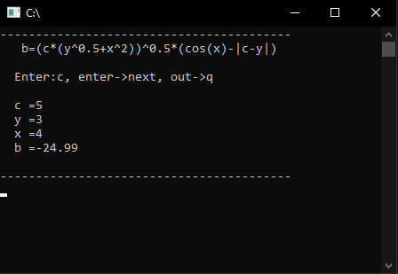

# C Programming Assignments – Console Application with Pseudographics

This project combines **three laboratory assignments** into a single executable program with a **menu-driven interface** and **pseudographics** for better user experience.

Each assignment is placed in a separate source file, and every task is implemented as an individual function. The main file (`main.c`) contains a **navigation menu** that allows the user to select and run any task using **function pointers** and **callback-style logic**. Navigation is done with arrow keys, and tasks are launched by pressing Enter.

---

## Structure

- **3 Assignments × 3 Tasks = 9 Tasks Total**
- Each task is in its own `.c` file.
- Menu system with visual navigation.
- Screenshots included for every task (shown below).




---
## 🔹Assignment 1: Basic Calculations

### Task 1.1 – Arithmetic Expression Calculator

A program that evaluates a user-entered arithmetic expression.  
- Input is done via keyboard.
- Pseudographics display the equation.
- Only digits and valid operators (`+`, `-`, `*`, `/`, `.`, `(`, `)`) are allowed.
- Users can edit input: delete characters, add decimal point or negative sign.
- The input buffer updates in real time.
- Press `Enter` to calculate and display the result on a new line.
- Press `q` at any time to exit.

*Screenshots: Example input and calculation process.*




---

### Task 1.2 – Sequential Number Input  
A program that reads multiple numbers from the user and computes a result.  
- Each number is prompted step by step.
- Input validation: if the user enters a letter, the program asks again.
- The program ends after all values are entered and processed.

📸 *Screenshots: Input validation and final result.*

---

### Task 1.3 – Function Table Generator  
Displays a table of values for a function `y = f(x)` over the interval `[a, b]` with step `h`.  
- Values are printed line by line with a small delay (animation effect).
- Clear, user-friendly output.

📸 *Screenshots: Animated output of the table.*

---

## 🔹 Assignment 2: Loops and Arrays

### Task 2.1 – Sum Calculation (No Arrays)  
Calculates a sum using a loop — **without using arrays**.  
- The process is visualized step by step.
- A progress bar is added for visual feedback and user engagement.

📸 *Screenshots: Step-by-step calculation with progress bar.*

---

### Task 2.2 – Data Processing from File  
Processes experimental humidity data from a file `data.txt` (50 values: `a1, a2, ..., a50`).  
- Reads values from file.
- Computes the average humidity.
- Calculates deviation of each value from the average.
- Output is animated to let the user follow the process.

📸 *Screenshot: File input and deviation results.*

---

### Task 2.3 – Matrix Row Processing  
Given a 4×5 matrix:
- Find the maximum element in each row.
- Replace the first element of the row with this maximum.
- If the original first element was not zero, save it into a separate array.
- Display the original matrix, modified matrix, and the saved array.

Input is read from a `.txt` file in format:  
```
1.3; 3.4; 1.6; 4.7; 6.2
7.8; 2.1; 2.6; 6.6; 8.1
...
```

📸 *Screenshots: Input matrix and step-by-step transformation.*

---

## 🔹 Assignment 3: Advanced Programming

### Task 3.1 – Matrix Normalization (Dynamic Memory)  
A program that normalizes an `m×n` matrix:
- User enters dimensions `m` and `n`.
- Memory is allocated dynamically.
- Each element is recalculated as:  
  `(sum of other elements in row) / (sum of other elements in column)`
- Original and resulting matrices are displayed.
- Memory is freed at the end.

**Note**: Input is done directly in a pseudographic table.  
**Limitation**: Large numbers may not fit in cells.

📸 *4 Screenshots: Input, calculation, result, and memory cleanup.*

---

### Task 3.2 – Bit Manipulation  
User enters a sequence of 8 characters.  
For each character:
- **Odd-positioned** (1st, 3rd, ...): set the 3rd bit to `1`.
- **Even-positioned** (2nd, 4th, ...): clear the 4th bit to `0`.

Results are shown in a table:
- Original and modified sequences.
- Octal codes for both.

📸 *2 Screenshots: Input and bit manipulation results.*

---

### Task 3.3 – Function Fold with Function Pointers  
Implements a `fold` function that sums all elements in an integer array using a provided `sum` function.  
- `fold` takes: pointer to array, array size, pointer to `sum` function.
- `sum(a, b)` returns `a + b`.
- `fold` applies `sum` cumulatively (like reduce).
- Each step is printed so the user can follow the process.

The function is tested with sample data.

📸 *Screenshots: Step-by-step folding process.*

---
🛠️ How to Run

1. Compile with any C compiler (e.g., `gcc`):
   ```bash
   gcc main.c kr_one_ex_one.c kr_one_ex_two.c kr_one_ex_three.c kr_two_ex_one.c kr_two_ex_two.c kr_two_ex_three.c kr_three_ex_one.c kr_three_ex_two.c kr_three_ex_three.c -o calculator
   ```
2. Run:
   ```bash
   ./calculator
   ```
3. Use **arrow keys** to navigate, **Enter** to select, **q** to exit anytime.

---


Let me know if you want this as a `.md` file or need to add actual image links!
