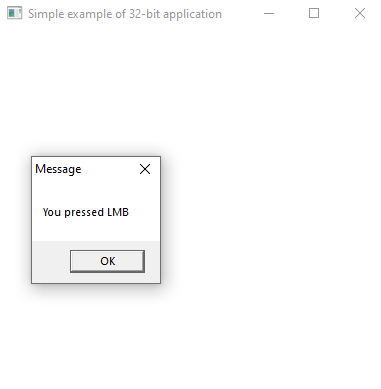
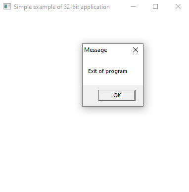

# Assembly Programming Task

## Task Description
Write an application using MASM x32 assembly language that creates a window in Windows system with the following functionality:
- Custom cursor changing
- Left mouse button click handling
- Exit on right mouse button click

## Requirements
- Use MASM x32 assembly
- Create a Windows GUI application
- Implement custom cursor handling
- Process left mouse button clicks
- Exit application on right mouse button click

## Example Screenshots

*Figure 1: Example of the application window with custom cursor*

*Figure 2: Demonstration of mouse click handling functionality*

## Implementation Notes
The application should:
1. Create a standard Windows window
2. Load and set a custom cursor
3. Handle WM_LBUTTONDOWN messages for left clicks
4. Handle WM_RBUTTONDOWN messages to exit the application
5. Properly clean up resources on exit

## Expected Behavior
- Window appears with custom cursor
- Left clicks can be detected and processed
- Right click immediately closes the application
- All Windows resources are properly managed