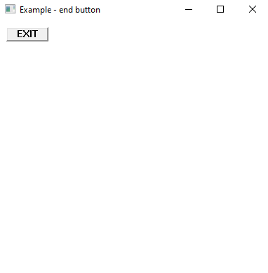
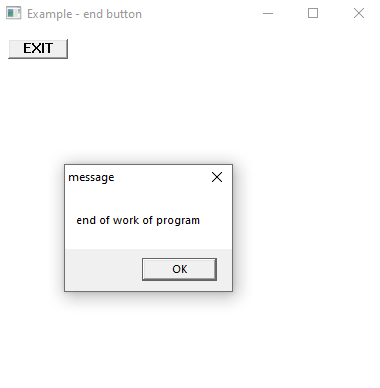

# MASM32 Assembly Project

This project is a simple Windows application written in **32-bit assembly language using MASM (Microsoft Macro Assembler)**.

## Description
- A window is created with a **label** and an **"Exit" button**.
- When the button is clicked, an **information message box** appears, asking the user if they want to exit.
- If "Yes" is selected, the program closes.
- If "No" is selected, the program returns to the main window.

## Screenshots

### Main Window

### Exit Confirmation Message
