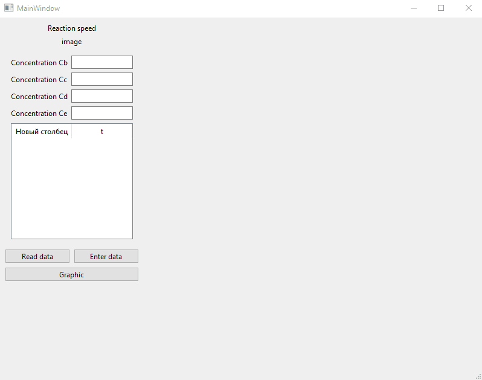

Kinetic Analyzer — Qt/C++ Project README
Структура файлов проекта
kinetic-analyzer/
├── main.cpp                     # Точка входа в приложение
├── mainwindow.h/.cpp            # Основное окно с интерфейсом и обработкой событий
├── ui_mainwindow.h              # Сгенерированный UI-код (из .ui файла)
├── KineticAnalyzer.h/.cpp       # Ядро анализа кинетики: регрессия, симуляция
├── regression_analysis.h/.cpp   # Модуль линейной регрессии (МНК)
└── resources.qrc                # Ресурсы (иконки, стили)
Ключевые компоненты:

KineticAnalyzer — расчёт порядка реакции n, константы скорости k, дисперсии и корреляции
RegressionAnalysis — реализация метода наименьших квадратов для линейной регрессии
MainWindow — управление данными, построение графиков (QtCharts), ввод/вывод
Использование программы (по шагам)
Шаг 1: Ввод экспериментальных данных
Выберается один из способов:

Вручную:
Кнопка "Ввести данные" → Укажите количество точек → Заполните таблицу [Время, Концентрация A]
Из файла:
Кнопка "Загрузить данные" → Выберите .txt/.csv файл с форматом:
  # комментарий (игнорируется)
  0.0   2.2
  1.7   1.7
  2.5   1.5
  ...
Шаг 2: Указание начальныч концентраций продуктов
Заполните поля:

C_B₀, C_C₀, C_D₀, C_E₀ — начальные концентрации компонентов B–E (моль/л)
Шаг 3: Запустить анализ
Нажмите Построить график → Программа выполнит:

Расчёт скоростей реакции: wᵢ = |ΔC_A|/Δt
Линеаризацию: ln(w) = ln(k) + n·ln(C_A)
Регрессионный анализ (МНК) для определения n и k
Симуляцию концентраций всех компонентов по времени
Расчёт статистических показателей
Шаг 4: Просмотр результатов
Всплывающее окно: порядок реакции n, константа k, дисперсия, коэффициент корреляции r
График: экспериментальные точки (A) + модельные кривые для всех компонентов (A, B, C, D, E)
Анализ кинетического уравнения
Рассматриваемая реакция (вариант 2 из методички):
A + 2B → C + D + E
Кинетическая модель:
Скорость расходования компонента A описывается уравнением:

−dC_A/dt = k · C_Aⁿ
где:

k — константа скорости реакции (зависит от температуры по Аррениусу)
n — порядок реакции (определяется экспериментально)
Линеаризация для регрессии:
Для применения МНК уравнение логарифмируется:

ln|dC_A/dt| = ln(k) + n · ln(C_A)
→ Получаем линейную зависимость y = b₀ + b₁·x, где:

y = ln(w), x = ln(C_A)
b₁ = n (порядок реакции)
b₀ = ln(k) → k = exp(b₀)
Стехиометрические соотношения при симуляции:
ΔC_B = −2 · ΔC_A
ΔC_C = +ΔC_A
ΔC_D = +ΔC_A
ΔC_E = +ΔC_A
(Реализовано в KineticAnalyzer::simulateConcentrations())

Визуальная часть интерфейса

Источники
Чистякова Т.Б. и др. «Программирование на языках высокого уровня. Курсовое проектирование» — СПбГТИ(ТУ), 2009
Страуструп Б. «Язык программирования C++»
Qt Documentation: Qt Charts, Model/View Programming