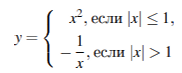
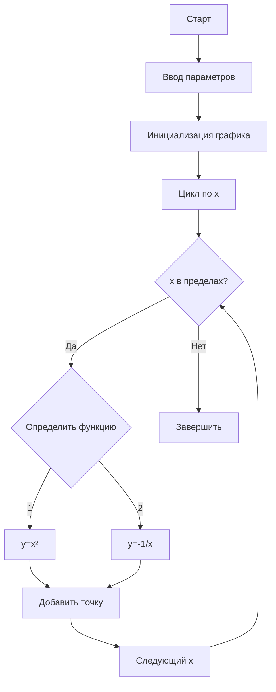
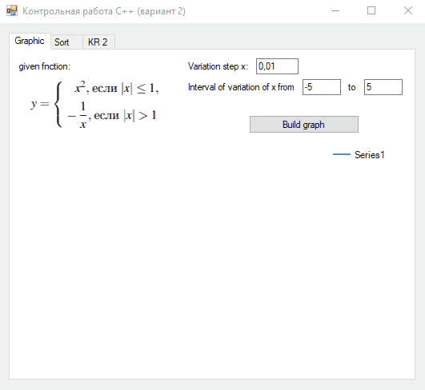
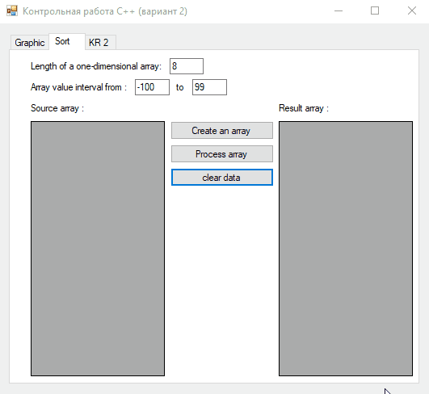
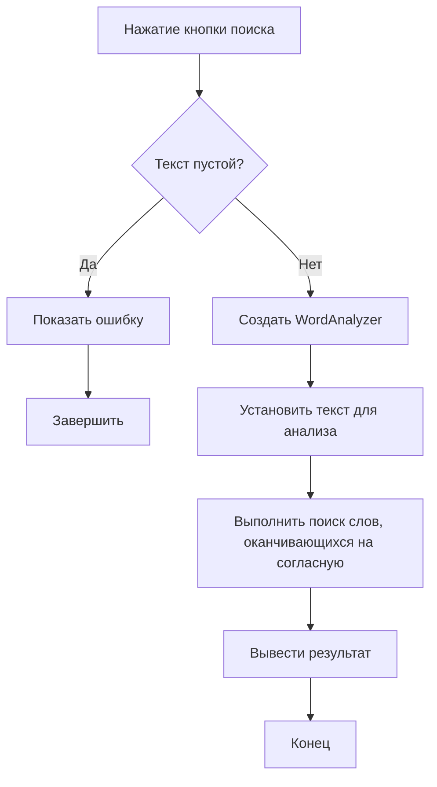

# Отчет по контрольным работам по дисциплине "Программирование на языках высокого уровня"

## Студент
**ФИО:** Брогли Кевин Аленович  
**Курс:** 2 курс  
**Направление:** 09.03.01 - Информатика и вычислительная техника  
**Профиль:** Автоматизированные системы обработки информации и управления

## Общая информация о проекте
- **Язык программирования:** C++/CLI
- **Интерфейс:** Windows Forms (.NET Framework)
- **Структура проекта:** Две контрольные работы объединены в одно приложение
- **Навигация:** Переключение между заданиями реализовано с помощью элемента `TabControl`

---

## Контрольная работа №1

### Задание 1: Построение графика функции

#### Описание задания
Разработано Windows Forms приложение, позволяющее построить график функции `y = f(x)` по нажатию кнопки. Пользователь может задавать:
- Интервал варьирования переменной x
- Шаг варьирования

Если функция не имеет значения в рассматриваемой точке, это отображается в виде прерывания графика. Для тестового примера использован шаг 0.01 и интервал [-5, 5].

#### Функция для построения


#### Блок-схема алгоритма (mermaid)


#### Пример работы программы


---

### Задание 2: Сортировка массива методом выбора

#### Описание задания
Реализована сортировка одномерного массива методом выбора (Selection Sort). Пользователь может вводить массив через графический интерфейс и выполнять его сортировку.

#### Описание алгоритма сортировки выбором
Алгоритм сортировки выбором работает по следующему принципу:
1. Находится минимальный элемент в неотсортированной части массива
2. Минимальный элемент меняется местами с первым элементом неотсортированной части
3. Граница отсортированной части сдвигается на один элемент вправо
4. Процесс повторяется для оставшейся неотсортированной части

#### Визуализация алгоритма


#### Блок-схема алгоритма сортировки
```mermaid
graph TD
    A[Начало SelectionSort] --> B[i = 0]
    B --> C{i < N-1?}
    C -->|Да| D[minIndex = i]
    D --> E[j = i+1]
    E --> F{j < N?}
    F -->|Да| G{Arr[j] < Arr[minIndex]?}
    G -->|Да| H[minIndex = j]
    H --> I[Увеличить j]
    G -->|Нет| I
    I --> F
    F -->|Нет| J{minIndex != i?}
    J -->|Да| K[Поменять местами Arr[i] и Arr[minIndex]]
    K --> L[Увеличить i]
    J -->|Нет| L
    L --> C
    C -->|Нет| M[Конец]
```

#### Пример работы программы


---

## Контрольная работа №2

### Задание: Поиск слов в тексте

#### Описание задания
Разработано Windows Forms приложение для поиска слов в тексте согласно варианту задания:
- Текст вводится пользователем через графический интерфейс
- Текст на русском языке
- Найти все слова, заканчивающиеся на согласную букву
- Реализован поиск с помощью собственного класса
- Результаты выводятся через графический интерфейс

#### Блок-схема алгоритма


#### Особенности реализации
1. Проверка входных данных на пустоту
2. Использование собственного класса `WordAnalyzer` для обработки текста
3. Определение согласных букв русского алфавита
4. Разделение текста на слова с учетом пунктуации

#### Пример работы программы


---

### Требования к системе
- Операционная система: Windows 7 и выше
- .NET Framework 4.0 или выше
- Среда разработки: Visual Studio 2015 или выше (для сборки проекта)

---

## Заключение
В ходе выполнения контрольных работ были освоены и продемонстрированы следующие навыки:
1. Работа с Windows Forms в C++/CLI
2. Построение графиков функций с обработкой особых случаев
3. Реализация алгоритмов сортировки (метод выбора)
4. Разработка классов для обработки текстовой информации
5. Создание интуитивно понятного графического интерфейса
6. Обработка пользовательского ввода и валидация данных