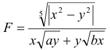
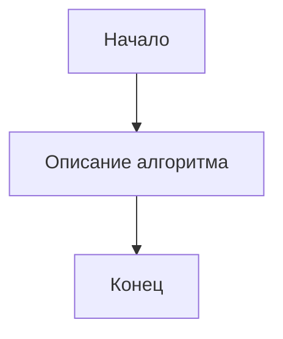

# Отчет по контрольным работам по дисциплине "Программирование"

**Брогли Кевин Аленович**, студент второго курса  
09.03.01 - Информатика и вычислительная техника  
(Автоматизированные системы обработки информации и управления)

---

## Контрольная работа №1

<details>
<summary>Задание 1</summary>

### Описание задания

Составить блок-схему алгоритма и написать программу вычисления арифметического выражения на языке программирования Python. Необходимо реализовать пошаговое вычисление выражения с проверкой допустимости операций (корни из отрицательных чисел, деление на ноль).



### Блок-схема алгоритма

```mermaid
flowchart TD
    A[Начало] --> B[Ввод x, y, a, b]
    B --> C[Вычисление |x² - y²|]
    C --> D[Вычисление числителя: |x² - y²|^(1/5)]
    D --> E[Вычисление a·y и b·x]
    E --> F{a·y < 0 или b·x < 0?}
    F -->|Да| G[Ошибка: корень из отриц. числа]
    F -->|Нет| H[Вычисление √(a·y) и √(b·x)]
    H --> I[Вычисление знаменателя: x·√(a·y) + y·√(b·x)]
    I --> J{Знаменатель ≈ 0?}
    J -->|Да| K[Ошибка: деление на ноль]
    J -->|Нет| L[Вычисление результата: числитель/знаменатель]
    L --> M[Вывод результата]
    G --> M
    K --> M
    M --> N[Конец]
```

### Результаты работы программы


### Таблица используемых объектов и переменных

| Объект/Переменная | Тип | Назначение |
|-------------------|-----|------------|
| `x1` | QLineEdit | Ввод значения x |
| `y1` | QLineEdit | Ввод значения y |
| `a1` | QLineEdit | Ввод значения a |
| `b1` | QLineEdit | Ввод значения b |
| `calc1_btn` | QPushButton | Кнопка запуска вычислений |
| `res1` | QLabel | Метка для вывода результата |
| `step1_label` | QLabel | Метка для отображения шага 1 |
| `step2_label` | QLabel | Метка для отображения шага 2 |
| `step3_label` | QLabel | Метка для отображения шага 3 |
| `step4_label` | QLabel | Метка для отображения шага 4 |
| `step5_label` | QLabel | Метка для отображения шага 5 |
| `diff_sq` | float | Промежуточное значение x² - y² |
| `abs_diff_sq` | float | Модуль разности квадратов |
| `numerator` | float | Числитель выражения |
| `denominator` | float | Знаменатель выражения |
| `ay`, `bx` | float | Промежуточные произведения |
| `sqrt_ay`, `sqrt_bx` | float | Квадратные корни |

</details>

<details>
<summary>Задание 2</summary>

### Описание задания

*(Описание второго задания третьей контрольной работы)*

### Блок-схема алгоритма



### Результаты работы программы


### Таблица используемых объектов и переменных

| Объект/Переменная | Тип | Назначение |
|-------------------|-----|------------|
| *(Переменные задания)* | *(Тип)* | *(Назначение)* |

</details>

<details>
<summary>Задание 3</summary>

### Описание задания

*(Описание третьего задания третьей контрольной работы)*

### Блок-схема алгоритма


### Результаты работы программы


### Таблица используемых объектов и переменных

| Объект/Переменная | Тип | Назначение |
|-------------------|-----|------------|
| *(Переменные задания)* | *(Тип)* | *(Назначение)* |

</details>

---

## Контрольная работа №2

<details>
<summary>Задание 1</summary>

### Описание задания

*(Описание первого задания четвертой контрольной работы)*

### Блок-схема алгоритма


### Результаты работы программы


### Таблица используемых объектов и переменных

| Объект/Переменная | Тип | Назначение |
|-------------------|-----|------------|
| *(Переменные задания)* | *(Тип)* | *(Назначение)* |

</details>

<details>
<summary>Задание 2</summary>

### Описание задания

*(Описание второго задания четвертой контрольной работы)*

### Блок-схема алгоритма


### Результаты работы программы


### Таблица используемых объектов и переменных

| Объект/Переменная | Тип | Назначение |
|-------------------|-----|------------|
| *(Переменные задания)* | *(Тип)* | *(Назначение)* |

</details>

<details>
<summary>Задание 3</summary>

### Описание задания

*(Описание третьего задания четвертой контрольной работы)*

### Блок-схема алгоритма


### Результаты работы программы


### Таблица используемых объектов и переменных

| Объект/Переменная | Тип | Назначение |
|-------------------|-----|------------|
| *(Переменные задания)* | *(Тип)* | *(Назначение)* |

</details>

---

---

## Контрольная работа №3

<details>
<summary>Задание 1</summary>

### Описание задания

*(Описание первого задания четвертой контрольной работы)*

### Блок-схема алгоритма


### Результаты работы программы


### Таблица используемых объектов и переменных

| Объект/Переменная | Тип | Назначение |
|-------------------|-----|------------|
| *(Переменные задания)* | *(Тип)* | *(Назначение)* |

</details>

<details>
<summary>Задание 2</summary>

### Описание задания

*(Описание второго задания четвертой контрольной работы)*

### Блок-схема алгоритма


### Результаты работы программы


### Таблица используемых объектов и переменных

| Объект/Переменная | Тип | Назначение |
|-------------------|-----|------------|
| *(Переменные задания)* | *(Тип)* | *(Назначение)* |

</details>

<details>
<summary>Задание 3</summary>

### Описание задания

*(Описание третьего задания четвертой контрольной работы)*

### Блок-схема алгоритма


### Результаты работы программы


### Таблица используемых объектов и переменных

| Объект/Переменная | Тип | Назначение |
|-------------------|-----|------------|
| *(Переменные задания)* | *(Тип)* | *(Назначение)* |

</details>