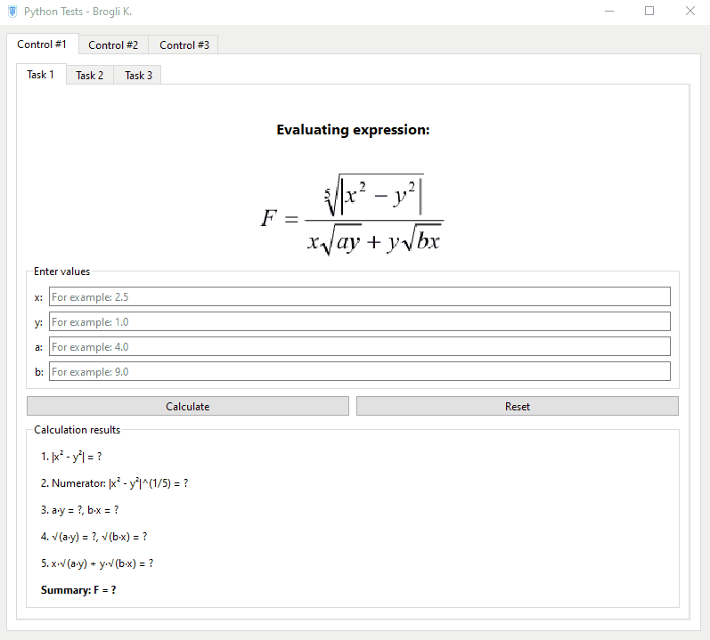
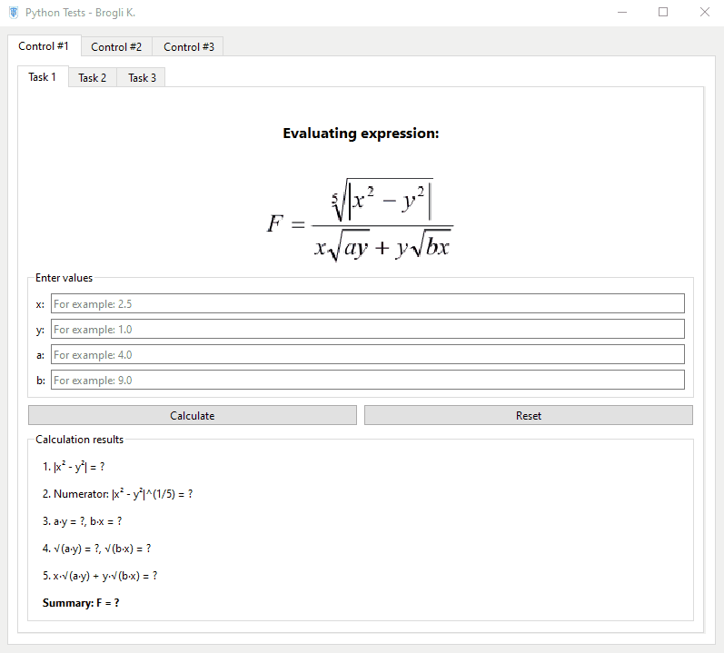
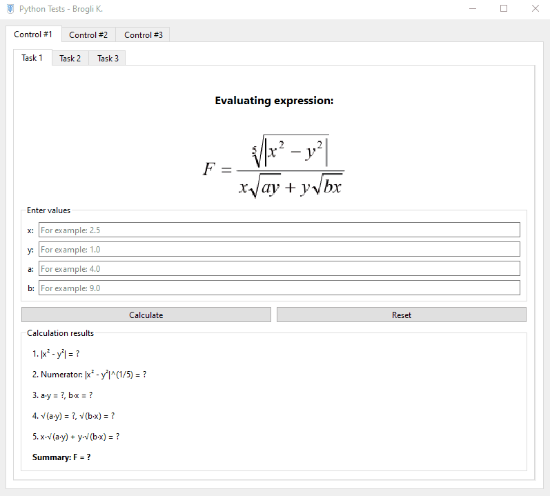

# Отчет по контрольным работам по дисциплине "ПРОГРАММИРОВАНИЕ НА ЯЗЫКЕ PYTHON"

**Брогли Кевин Аленович**, студент второго курса  
09.03.01 - Информатика и вычислительная техника  
(Автоматизированные системы обработки информации и управления)


## Структура проекта

```
project/
├── main.py                   # Основной файл с меню и навигацией
├── core.py                   # Ядро программы с логикой контрольных работ
├── exercise1_ui.py           # UI для упражнения 1 контрольной 1
├── exercise2_ui.py           # UI для упражнения 2 контрольной 1
├── exercise3_ui.py           # UI для упражнения 3 контрольной 1
├── exercise1_ui_control2.py  # UI для упражнения 1 контрольной 2
├── exercise2_ui_control2.py  # UI для упражнения 2 контрольной 2
├── exercise3_ui_control2.py  # UI для упражнения 3 контрольной 2
├── exercise1_ui_control3.py  # UI для упражнения 1 контрольной 3
├── exercise2_ui_control3.py  # UI для упражнения 2 контрольной 3
└── exercise3_ui_control3.py  # UI для упражнения 3 контрольной 3
```

## Управление

- **Стрелки ↑↓** — навигация по меню
- **Enter** — выбор пункта
- **Esc** — возврат назад
- **Q** — выход из программы
- **A** — информация о программе
- **С** — для расчета где это уместно

## Архитектура

### Основные компоненты

1. **main.py** — точка входа, содержит:
   - Главное меню с логотипом
   - Навигацию между контрольными работами
   - Экран подтверждения выхода
   - Экран "О программе"

2. **core.py** — ядро программы, содержит три класса:
   - `Control1` — методы для контрольной работы 1
   - `Control2` — методы для контрольной работы 2  
   - `Control3` — методы для контрольной работы 3

3. **UI-модули** — отдельные файлы для графического интерфейса каждого упражнения. Проект представляет собой систему для выполнения контрольных работ по программированию на Python с текстовым пользовательским интерфейсом, реализованным с помощью библиотеки `curses`.

## Контрольная работа №1

### Описание задания #1

Составить блок-схему алгоритма и написать программу вычисления арифметического выражения на языке программирования Python. Необходимо реализовать пошаговое вычисление выражения с проверкой допустимости операций (корни из отрицательных чисел, деление на ноль).


### Блок-схема алгоритма

```mermaid
flowchart TD
    A[Начало Exercise_1] --> B[Ввод x, y, a, b]
    B --> C{Проверка: a == 0 или b == 0?}
    C -->|Да| D[Возврат ошибки: "Division by zero a or b is zero"]
    C -->|Нет| E[Вычисление numerator_cbrt = x² + y² ** 1/3]
    E --> F[Вычисление denominator_sqrt = sqrtx⁴ + y⁴]
    F --> G{denominator_sqrt == 0?}
    G -->|Да| H[Возврат ошибки: "Denominator is zero x and y are both zero"]
    G -->|Нет| I[Вычисление bracket_term:<br>a*x² + a/b*x²*y - b/a*x*y² + b*y²]
    I --> J[Вычисление result = numerator_cbrt / denominator_sqrt * bracket_term]
    J --> K[Возврат result, None]
    D --> L[Возврат None, error]
    H --> L
    L --> M[Конец]
    
    style A fill:#2ecc71
    style M fill:#e74c3c
    style C fill:#3498db
    style G fill:#3498db
    style D fill:#f39c12
    style H fill:#f39c12
    style K fill:#2ecc71
```

### Результаты работы программы



### Описание задания #2

Составить блок-схему алгоритма и написать программу вычисления арифметического выражения на языке программирования Python. Необходимо реализовать пошаговое вычисление сложного выражения, включающего полином, модули, корни и тригонометрические функции с проверкой допустимости операций (деление на ноль, корень из отрицательного числа).


### Блок-схема алгоритма

```mermaid
flowchart TD
    A[Начало Exercise_2] --> B[Ввод x, y, a, b]
    B --> C{Проверка: a == 0?}
    C -->|Да| D[Возврат ошибки: "Division by zero a is zero"]
    C -->|Нет| E[Вычисление p = a + b + x + y / 2]
    E --> F[Вычисление arg = x - p/a]
    F --> G[Вычисление sin2 = sinarg²]
    G --> H[Вычисление cos2 = cosarg²]
    H --> I[Вычисление numerator = y² + x*y + x²]
    I --> J[Вычисление denominator = a² + b²]
    J --> K{denominator == 0?}
    K -->|Да| L[Возврат ошибки: "Denominator is zero a and b are both zero"]
    K -->|Нет| M[Вычисление result = sin2 + numerator/denominator * cos2]
    M --> N[Возврат result, None]
    D --> O[Возврат None, error]
    L --> O
    O --> P[Конец]
    
    style A fill:#2ecc71
    style P fill:#e74c3c
    style C fill:#3498db
    style K fill:#3498db
    style D fill:#f39c12
    style L fill:#f39c12
    style N fill:#2ecc71
```

### Результаты работы программы




### Описание задания #3

Составить блок-схему алгоритма и написать программу, вычисляющую значение кусочно-заданной функции в зависимости от условий. Функция принимает разные значения в зависимости от попадания аргумента x в определенные интервалы: y=0 при x≤-π/2, y=cos(x) при -π/2<x≤0, y=1 при x>0.


### Блок-схема алгоритма

```mermaid
flowchart TD
    A[Начало Exercise_3] --> B[Ввод x]
    B --> C{x ≤ -1?}
    C -->|Да| D["result = x² - 1<br>condition = 'x ≤ -1 → y = x² - 1'"]
    C -->|Нет| E{|x| < 1?}
    E -->|Да| F{x == 0?}
    F -->|Да| G[Возврат ошибки: 'Division by zero in cos(π/(2x))']
    F -->|Нет| H["result = cos(π/(2x))<br>condition = '|x| < 1 → y = cos(π/(2x))'"]
    E -->|Нет| I{x ≥ 1?}
    I -->|Да| J["result = 0<br>condition = 'x ≥ 1 → y = 0'"]
    I -->|Нет| K[Возврат ошибки: 'Unhandled case']
    
    D --> L[Возврат: result, condition, None]
    H --> L
    J --> L
    
    G --> M["Возврат: None, '', 'Error: Division by zero...'"]
    K --> N["Возврат: None, 'Error: Unhandled case', ''"]
    
    L --> O[Конец]
    M --> O
    N --> O
    
    style A fill:#2ecc71
    style O fill:#e74c3c
    style C fill:#3498db
    style E fill:#3498db
    style F fill:#9b59b6
    style I fill:#3498db
    style G fill:#f39c12
    style K fill:#f39c12
    style L fill:#2ecc71
```

### Результаты работы программы



---

## Контрольная работа №2

### Описание задания #1

Напишите программу, вычисляющую значения функции на промежутке [a,b] с шагом h. Значения a,b и h выберите самостоятельно так, чтобы выявить 
основные особенности поведения функции. В качестве оператора цикла используйте оператор цикла с параметром. Составьте блок-схему алгоритма. 


### Блок-схема алгоритма

```mermaid
flowchart TD
    A[Начало Exercise_1<br>Control 2] --> B[Ввод a, b, h]
    B --> C{h ≤ 0?}
    C -->|Да| D[Возврат ошибки: "Step h must be positive"]
    C -->|Нет| E{a > b?}
    E -->|Да| F[Возврат ошибки: "a must be <= b"]
    E -->|Нет| G[Инициализация: results = []<br>x = a]
    G --> H{x ≤ b?}
    H -->|Нет| I[Возврат results, None]
    H -->|Да| J{x ≤ -1?}
    J -->|Да| K[y = 0.0]
    J -->|Нет| L{-1 < x < 0?}
    L -->|Да| M[y = 1 + x]
    L -->|Нет| N{x ≥ 1?}
    N -->|Да| O["y = cos(π·x/2)"]
    N -->|Нет| P[y = None<br>0 ≤ x < 1 не определено]
    K --> Q[Добавить x, y в results]
    M --> Q
    O --> Q
    P --> Q
    Q --> R[Обновить x = roundx + h, 10]
    R --> H
    
    D --> S[Возврат None, error]
    F --> S
    S --> T[Конец]
    I --> T
    
    style A fill:#2ecc71
    style T fill:#e74c3c
    style C fill:#3498db
    style E fill:#3498db
    style H fill:#9b59b6
    style J fill:#3498db
    style L fill:#3498db
    style N fill:#3498db
    style D fill:#f39c12
    style F fill:#f39c12
    style I fill:#2ecc71
    style K fill:#1abc9c
    style M fill:#1abc9c
    style O fill:#1abc9c
    style P fill:#95a5a6
```

### Результаты работы программы


### Описание задания #2

Напишите программу, вычисляющую значения функции на промежутке [a,b] с шагом h. Значения a,b и h выберите самостоятельно так, чтобы выявить основные особенности поведения функции. В качестве оператора цикла используйте оператор цикла с предусловием. Составьте блок-схему алгоритма. 


### Блок-схема алгоритма

```mermaid
flowchart TD
    A[Начало Exercise_2<br>Control 2] --> B[Ввод a, b, h]
    B --> C{h ≤ 0?}
    C -->|Да| D[Возврат ошибки: "Step h must be positive"]
    C -->|Нет| E{a > b?}
    E -->|Да| F[Возврат ошибки: "a must be <= b"]
    E -->|Нет| G[Инициализация: results = []<br>x = a]
    G --> H{x ≤ b?}
    H -->|Нет| I[Возврат results, None]
    H -->|Да| J{x ≤ 0?}
    J -->|Да| K["y = e⁻ˣ<br>экспоненциальная функция"]
    J -->|Нет| L{0 < x < 1?}
    L -->|Да| M["y = cos(π·x/2)<br>косинус на интервале"]
    L -->|Нет| N{x ≥ 1?}
    N -->|Да| O[y = 0.0<br>константа]
    N -->|Нет| P[y = None<br>неопределенный случай]
    K --> Q[Добавить x, y в results]
    M --> Q
    O --> Q
    P --> Q
    Q --> R[Обновить x = roundx + h, 10]
    R --> H
    
    D --> S[Возврат None, error]
    F --> S
    S --> T[Конец]
    I --> T
    
    style A fill:#2ecc71
    style T fill:#e74c3c
    style C fill:#3498db
    style E fill:#3498db
    style H fill:#9b59b6
    style J fill:#3498db
    style L fill:#3498db
    style N fill:#3498db
    style D fill:#f39c12
    style F fill:#f39c12
    style I fill:#2ecc71
    style K fill:#1abc9c
    style M fill:#1abc9c
    style O fill:#1abc9c
    style P fill:#95a5a6
```

### Результаты работы программы


### Описание задания #3

Напишите программу, вычисляющую значения функции на промежутке [a,b] с шагом h. Значения a,b и h выберите самостоятельно так, чтобы выявить основные особенности поведения функции. В качестве оператора цикла используйте операторы цикла с параметром и с предусловием. Составьте блок схему алгоритма. 


### Блок-схема алгоритма

```mermaid
flowchart TD
    A[Начало Exercise_3<br>Control 2] --> B[Ввод a, b, h]
    B --> C{h ≤ 0?}
    C -->|Да| D[Возврат ошибки: "Step h must be positive"]
    C -->|Нет| E{a > b?}
    E -->|Да| F[Возврат ошибки: "a must be <= b"]
    E -->|Нет| G[Инициализация: results = []<br>x = a]
    G --> H{x ≤ b?}
    H -->|Нет| I[Возврат results, None]
    H -->|Да| J{"x < -π/2?"}
    J -->|Да| K[y = 0.0<br>константа нуль]
    J -->|Нет| L{"-π/2 ≤ x ≤ 0?"}
    L -->|Да| M["y = cosx<br>косинус на интервале [-π/2, 0]"]
    L -->|Нет| N{x > 0?}
    N -->|Да| O[y = 1.0<br>константа единица]
    N -->|Нет| P[y = None<br>теоретически недостижимо]
    K --> Q[Добавить x, y в results]
    M --> Q
    O --> Q
    P --> Q
    Q --> R[Обновить x = roundx + h, 10]
    R --> H
    
    D --> S[Возврат None, error]
    F --> S
    S --> T[Конец]
    I --> T
    
    style A fill:#2ecc71
    style T fill:#e74c3c
    style C fill:#3498db
    style E fill:#3498db
    style H fill:#9b59b6
    style J fill:#3498db
    style L fill:#3498db
    style N fill:#3498db
    style D fill:#f39c12
    style F fill:#f39c12
    style I fill:#2ecc71
    style K fill:#1abc9c
    style M fill:#1abc9c
    style O fill:#1abc9c
    style P fill:#95a5a6
```

### Результаты работы программы


---

## Контрольная работа №3

### Описание задания #1 

Составить блок-схему алгоритма и написать программу вычисления суммы для указанного значения x.


### Блок-схема алгоритма

```mermaid
flowchart TD
    A[Начало Exercise_1<br>Control 3] --> B["Ввод x, n<br>default: x = π/8, n = 10"]
    B --> C{n < 2?}
    C -->|Да| D[Возврат ошибки: "n must be >= 2"]
    C -->|Нет| E["Инициализация:<br>total = 0.0<br>cos_x = cosx<br>factorial = 1"]
    E --> F[Цикл for k от 1 до n]
    F --> G[factorial = factorial * k]
    G --> H{k ≥ 2?}
    H -->|Да| I["term = cos_xᵏ / factorial"]
    I --> J[total = total + term]
    J --> K[Перейти к следующему k]
    H -->|Нет| K
    K --> L{Есть еще k?}
    L -->|Да| F
    L -->|Нет| M[Возврат total, None]
    
    D --> N[Возврат None, error]
    N --> O[Конец]
    M --> O
    
    style A fill:#2ecc71
    style O fill:#e74c3c
    style C fill:#3498db
    style F fill:#9b59b6
    style H fill:#3498db
    style D fill:#f39c12
    style M fill:#2ecc71
    style G fill:#1abc9c
    style I fill:#1abc9c
    style J fill:#1abc9c
```

### Результаты работы программы


### Описание задания #2

Вычислить сумму элементов последовательности x_1, x_2, x_3, ... ,x_n ( n ≤ 20 ), удовлетворяющих неравенству x > p.

### Блок-схема алгоритма

```mermaid
flowchart TD
    A[Начало] --> B[Ввод sequence, p]
    B --> C{sequence не список?}
    C -->|Да| D[Возврат ошибки: "Sequence must be a list"]
    C -->|Нет| E{len(sequence) == 0?}
    E -->|Да| F[Возврат 0.0, None]
    E -->|Нет| G{len(sequence) > 20?}
    G -->|Да| H[Возврат ошибки: "Sequence length must be ≤ 20"]
    G -->|Нет| I["Инициализация total = 0<br>Проход по элементам sequence"]
    I --> J[Для каждого x в sequence]
    J --> K{x > p?}
    K -->|Да| L[total = total + x]
    K -->|Нет| M[Пропустить элемент]
    L --> N[Следующий элемент]
    M --> N
    N --> O{Все элементы обработаны?}
    O -->|Нет| J
    O -->|Да| P[Возврат total, None]
    
    D --> Q[Возврат None, error]
    F --> R[Конец]
    H --> Q
    P --> R
    Q --> R
    
    style A fill:#2ecc71
    style R fill:#e74c3c
    style C fill:#3498db
    style E fill:#3498db
    style G fill:#3498db
    style J fill:#9b59b6
    style K fill:#3498db
    style D fill:#f39c12
    style H fill:#f39c12
    style F fill:#2ecc71
    style P fill:#2ecc71
    style L fill:#1abc9c
```

### Результаты работы программы


### Описание задания

Вычислить суммы элементов каждой строки матрицы B(5x4), определить наименьшее значение среди этих сумм и номер соответствующей строки. 

### Блок-схема алгоритма

```mermaid
flowchart TD
    A[Начало Exercise_3<br>Control 3] --> B[Ввод matrix<br>матрица 5×4]
    B --> C{"matrix пуста<br>или rows ≠ 5?"}
    C -->|Да| D[Возврат ошибки: "Matrix must have exactly 5 rows"]
    C -->|Нет| E[Проверить каждую строку]
    E --> F[Для каждой строки в matrix]
    F --> G{len(строки) ≠ 4?}
    G -->|Да| H[Возврат ошибки: "Each row must have exactly 4 elements"]
    G -->|Нет| I[Следующая строка]
    I --> J{Все строки проверены?}
    J -->|Нет| F
    J -->|Да| K[Инициализация: row_sums = []]
    K --> L[Для каждой строки в matrix]
    L --> M[Вычисление sum(строка)]
    M --> N[Добавить сумму в row_sums]
    N --> O[Следующая строка]
    O --> P{Все строки обработаны?}
    P -->|Нет| L
    P -->|Да| Q["Найти min_sum = min(row_sums)"]
    Q --> R["Найти min_index = index(min_sum) + 1"]
    R --> S[Возврат (min_index, min_sum), None]
    
    D --> T[Возврат None, error]
    H --> T
    T --> U[Конец]
    S --> U
    
    style A fill:#2ecc71
    style U fill:#e74c3c
    style C fill:#3498db
    style G fill:#3498db
    style F fill:#9b59b6
    style L fill:#9b59b6
    style Q fill:#3498db
    style D fill:#f39c12
    style H fill:#f39c12
    style S fill:#2ecc71
    style M fill:#1abc9c
    style N fill:#1abc9c
```

### Результаты работы программы


